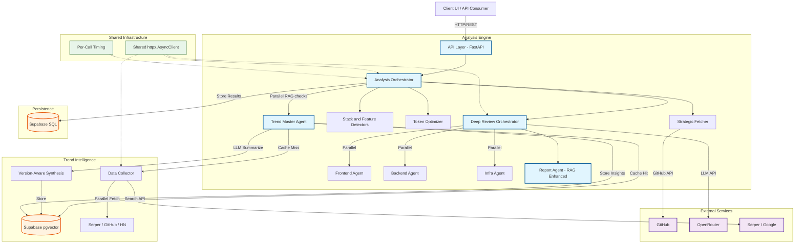
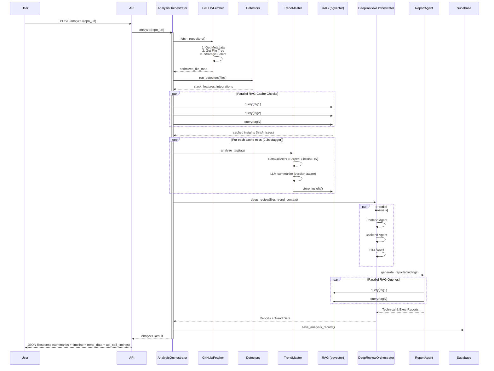
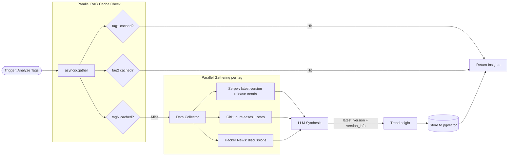

# Backend Architecture & User Flows

This document outlines the architecture, components, and core user flows of the AI Development Advisor backend.

## 1. System Architecture

The backend is a **FastAPI** application designed with a modular "Advisor" architecture. It orchestrates complex analysis workflows using specialized agents, aggressive optimization, strategic data retrieval, and **RAG-based trend intelligence** with version-aware market data.

### High-Level Architecture Diagram

### Core Components

#### 1. API Layer (`advisor/api`)
-   **FastAPI** application serving REST endpoints.
-   Handles request validation, async processing, and response serialization.
-   **Key Endpoints**:
    -   `POST /analyze`: Triggers full repository analysis provided a GitHub URL.
    -   `GET /analyses`: Lists recent analysis history.
    -   `GET /health`: System health check.

#### 2. Analysis Engine (`advisor/analysis`)
The heart of the system, composed of multiple specialized sub-modules:

-   **Orchestration**:
    -   **`AnalysisOrchestrator`**: Manages the end-to-end workflow: fetching, detection, **parallel RAG trend enrichment**, deep review, and persistence. Uses `asyncio.gather` for concurrent RAG cache checks and trend data collection.
    -   **`DeepReviewOrchestrator`**: Coordinates parallel LLM-based code review (partitioning into Frontend/Backend/Infrastructure).
    -   **`ReportAgent`**: Enhances findings with historical context via parallel RAG queries. Generates technical and executive reports with trend intelligence (momentum, risks, opportunities, version info).
    -   **`TokenOptimizer`**: Aggressively compresses code (removes imports, comments, whitespace) to maximize context window usage (~40-60% compression).
    -   **`AnalysisTimeline`**: Records per-phase timestamps and per-API-call `duration_ms` for granular performance profiling.

-   **Detectors** (`advisor/analysis/detectors`):
    -   **`StackDetector`**: Identifies languages, frameworks, databases, and tools from file signatures (package.json, pyproject.toml, etc.).
    -   **`FeatureExtractor`**: Detects user-facing features (Auth, Payments) from API routes and regex patterns.
    -   **`IntegrationInventory`**: Catalogs third-party services (Stripe, AWS, Sentry) and provides cost tier estimates.

-   **Analyzers** (`advisor/analysis/analyzers`):
    -   **`ArchitectureAnalyzer`**: Identifies patterns (MVC, Microservices) and structural integrity using file tree analysis.
    -   **`BusinessAnalyzer`**: Infers business models (SaaS, Freemium), revenue drivers, and growth mechanisms from code.
    -   **`RiskAnalyzer`**: Scans for security vulnerabilities, technical debt, and scalability gaps.
    -   **`RecommendationEngine`**: Generates actionable, prioritized improvements based on findings.

#### 3. Data Retrieval
-   **GitHub Client** (`advisor/github`):
    -   **`StrategicFetcher`**: Implements a smart 3-pass fetching strategy:
        1.  Fetch full file tree (up to deep nesting).
        2.  Prioritize files based on relevance (routes > models > config > utils).
        3.  Parallel batch fetch of top ~150 files to respect token limits.
    -   Handles ephemeral access tokens and rate limiting.

#### 4. Trend Intelligence (`advisor/trends`)
Autonomous agent for tracking and matching technology trends with **version-aware** data.

-   **`TrendMaster`**: Orchestrates data collection, LLM summarization (extracts `latest_version`, `version_info`), and RAG storage.
-   **`DataCollector`**: Parallel fetcher for multiple sources:
    -   **Serper API**: Google search for `"{tag} latest version release trends 2026"`.
    -   **GitHub API**: Trending repositories, stars/forks, and release data.
    -   **Hacker News**: Discussion sentiment and top stories via Algolia.
    -   **Dev.to**: Developer articles and reactions.
-   **`TrendAggregator`**: Normalizes and scores trend data from disparate sources.
-   **`TrendMatcher`**: Calculates relevance scores between global trends and the user's specific tech stack.
-   **`RAGManager`**: Manages vector storage/retrieval in Supabase pgvector. Supports `store_insight()` (upsert) and `get_recent()` (cache check, <7 days).

**Data flow:** RAG cache check (parallel via `asyncio.gather`) → cache miss → `DataCollector` fetches fresh data → `TrendMaster` summarizes via LLM → insight stored back to RAG → enriched context passed to `ReportAgent`.

#### 5. Infrastructure & Persistence
-   **Database**: **Supabase** (PostgreSQL)
    -   Stores `AnalysisRecords` with flexible JSONB columns for analysis results.
    -   Uses `pgvector` for trend similarity search.
    -   Schema defined in `migrations/001_create_analysis_records.sql`.
-   **LLM Provider**: **OpenRouter**
    -   Accesses best-in-class models (DeepSeek, Kimi, GPT-4o).
    -   **Shared `httpx.AsyncClient`** — lazy-initialized, reused across all calls (no per-request TCP/TLS overhead).
    -   Automatic key rotation and model fallback logic.
    -   Per-call `duration_ms` tracking for performance profiling.
    -   `close()` method for graceful shutdown.

---

## 2. Key User Flows

### A. Repository Analysis Flow (`/analyze`)
*The primary "Deep Scan" workflow.*

1.  **Ingestion**:
    -   User authenticates (optional) and submits a Repo URL.
    -   API validates request and spawns `AnalysisOrchestrator` (async).

2.  **Strategic Discovery**:
    -   `GitHubClient` validates the repo and fetches the file tree.
    -   `StrategicFetcher` scores every file based on patterns (e.g., `*.config.js` = high value, `*.test.ts` = lower value).
    -   Top ~100-150 files are fetched in parallel batches.

3.  **Static Analysis & Detection**:
    -   `StackDetector` identifies the tech stack.
    -   `FeatureExtractor` maps API routes to user features.
    -   `IntegrationInventory` catalogs external services.

4.  **Deep AI Review (The Core)**:
    -   **Optimization**: `TokenOptimizer` compresses source code.
    -   **Partitioning**: Code is split into logical contexts (Frontend, Backend, Infra).
    -   **Parallel Analysis**: Three specialized LLM agents review these partitions simultaneously.

5.  **Trend Enrichment (RAG-First)**:
    -   **Parallel RAG cache checks** for all detected tech tags via `asyncio.gather`.
    -   **Cache miss** → `TrendMaster` collects fresh data from Serper/GitHub/HN (parallel), LLM summarizes with version info, and stores insight back to RAG.
    -   **Enriched context** includes: momentum, key risks, opportunities, direction, `latest_version`, `version_info`, and top sources with links.

6.  **Synthesis & Reporting**:
    -   `ReportAgent` queries RAG in parallel for historical trend context.
    -   Generates two distinct reports:
        -   **Technical Deep Dive**: For engineering leadership.
        -   **Executive Brief**: For stakeholders (ROI, Risk, Opportunity).
    -   Both reports are enriched with version-aware trend intelligence.

7.  **Persistence**:
    -   Complete record (including `timeline` and `trend_data`) is saved to Supabase `analysis_records`.
    -   Results returned with `api_call_timings` for per-call performance visibility.

### B. Trend Analysis Flow
*Agentic workflow for market intelligence.*

1.  **Trigger**:
    -   System requests analysis for a tag (e.g., "React").
    -   `TrendMaster` checks `RAGManager` (Supabase Vector Store).

2.  **Cache Hit/Miss**:
    -   **Hit**: Returns cached insight (< 7 days old).
    -   **Miss**: Triggers `DataCollector`.

3.  **Multi-Source Gathering**:
    -   Parallel execution of Google Search, GitHub Search, Hacker News, and Dev.to.

4.  **Synthesis (Version-Aware)**:
    -   LLM processes raw data into a structured `TrendInsight`.
    -   Extracts: `latest_version`, `version_info`, momentum, key risks, opportunities, direction.
    -   Produces `TrendSourceInfo` objects with links, dates, and relevance scores.

5.  **Matching**:
    -   `TrendMatcher` compares the insight against the user's specific stack.
    -   Identifies opportunities: **Upgrade**, **Migration**, or **New Feature**.

6.  **Storage & Context**:
    -   Insight is embedded and stored in Supabase pgvector for future retrieval.
    -   `_format_insight()` builds rich context strings with version details and source links for the report agents.

---

## 3. Data Models

### AnalysisRecord (Database Schema)
Designed for flexibility using JSONB to avoid rigid schema migrations for report changes.

| Field | Type | Description |
|-------|------|-------------|
| `id` | UUID | Unique analysis ID |
| `repo_url` | Text | Target repository |
| `tech_stack` | JSONB | Detected languages, frameworks, tools |
| `features` | JSONB | Detected user-facing capabilities |
| `risks_and_gaps` | JSONB | Security, debt, and scalability findings |
| `recommendations` | JSONB | Prioritized action items |
| `technical_summary` | Text | Full markdown technical report |
| `executive_summary` | Text | Full markdown business report |
| `business_model` | JSONB | Inferred monetization and growth model |
| `integrations` | JSONB | Third-party services and costs |
| `timeline` | JSONB | Per-phase + per-API-call timing breakdown |
| `trend_data` | JSONB | Version-aware trend intelligence |
| `api_call_timings` | JSONB | Per-call latency breakdown (extracted from timeline) |

---

## 4. Current Implementation Status

### ✅ Completed
-   **Core API**: fully functional FastAPI application.
-   **Analysis Engine**: robust orchestration, optimization, and parallel LLM review.
-   **Detectors**: highly accurate patterns for stack, features, and integrations.
-   **Trend Engine**: agentic system with RAG, multi-source collection, and **version-aware LLM summarization**.
-   **Performance Pipeline**: shared `httpx.AsyncClient`, parallel `asyncio.gather` for RAG/trends/agents, and per-API-call `duration_ms` timing.
-   **Database**: Supabase integration with proper migration scripts (`scripts/run_migration.py`).
-   **GitHub Integration**: smart strategic fetching implementation.
-   **Settings**: centralized configuration with environment validation.
-   **API Response**: enriched with `timeline`, `api_call_timings`, and `trend_data`.

### 🚧 In Progress / Planned
-   **Report Generator**: `advisor/reports/generator.py` exists as a stub; PDF generation logic needs implementation.
-   **Testing**: Basic test suite exists (`tests/`), coverage could be expanded for new trend and timing modules.
-   **UI**: Streamlit interface (`advisor/ui/app.py`) is functional but basic.
